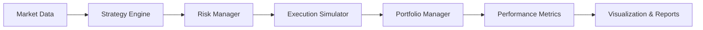

# Algorithmic Trading Backtester

A professional‑grade algorithmic trading backtester and quant research platform. Design strategies, simulate execution with realistic friction, and evaluate performance like a hedge fund.

[](https://www.python.org/)
[](LICENSE)

> **Disclaimer**: This project is for research and educational use only. Past performance does not guarantee future results.

---

## What Problem Does This Solve?

Most retail backtesting tools ignore execution costs, slippage, and risk management — the things that *actually* determine whether a strategy works in production. This platform models them from the ground up:

- **Realistic execution** — slippage (fixed, volume‑based, spread), transaction fees, and latency
- **Proper risk management** — stop‑loss, take‑profit, drawdown circuit breakers, Kelly criterion sizing
- **Pluggable strategies** — swap strategies without touching infrastructure
- **Statistical rigor** — walk‑forward validation, parameter sweeps, and a full metrics suite

---

## Architecture

```
Market Data → Strategy Engine → Risk Manager → Execution Simulator
                                             → Portfolio Manager → Metrics → Reports
```



Each box is a **separate module** with a clean interface:

| Module | Purpose |
|--------|---------|
| `data/` | CSV/Parquet ingestion, OHLCV cleaning, Yahoo Finance & Alpaca providers |
| `strategies/` | Pluggable strategy engine (5 built‑in strategies) |
| `execution/` | Slippage models, fee structures, latency simulation |
| `portfolio/` | Position tracking, equity curve, leverage monitoring |
| `risk/` | Stop‑loss, drawdown scaling, Kelly sizing, exposure limits |
| `metrics/` | Sharpe, Sortino, win rate, profit factor, monthly breakdowns |
| `backtester/` | Orchestration: walk‑forward, parameter sweeps, multi‑strategy |
| `visualization/` | Dark‑themed equity curves, drawdown charts, trade plots, heatmaps |

---

## Built‑In Strategies

| Strategy | Type | Description |
|----------|------|-------------|
| `ma_crossover` | Trend‑following | EMA crossover with vol‑targeted sizing |
| `rsi_mean_reversion` | Mean reversion | Buys oversold / sells overbought via RSI |
| `momentum_breakout` | Momentum | Donchian channel breakout with ATR sizing |
| `pairs_trading` | Stat arb | Z‑score spread trading between two assets |
| `ml_signal` | Machine learning | Logistic regression on engineered features |

All strategies implement the same `Strategy` interface:

```python
class Strategy(ABC):
    def generate_signals(self, market_data: pd.DataFrame) -> pd.DataFrame:
        """Returns DataFrame with 'signal' (+1/-1/0) and 'position_size'."""
```

---

## Installation

```bash
git clone https://github.com/yourusername/Algorithmic-Trading-Backtester.git
cd Algorithmic-Trading-Backtester
pip install -r requirements.txt
```

**Optional** (for live data feeds):
```bash
pip install yfinance        # Yahoo Finance (free)
pip install alpaca-py       # Alpaca Markets
```

---

## Quick Start

### Run a backtest
```bash
python main.py backtest --strategy ma_crossover --symbol AAPL --source yahoo
```

### Walk‑forward validation
```bash
python main.py walkforward --strategy rsi_mean_reversion --symbol AAPL
```

### Parameter sweep
```bash
python main.py sweep --strategy ma_crossover --fast-span 10,20,50 --slow-span 30,50,100 --symbol AAPL
```

### Compare strategies
```bash
python main.py compare --strategies ma_crossover,rsi_mean_reversion,momentum_breakout --symbol AAPL
```

### Backtest from CSV
```bash
python main.py backtest --strategy momentum_breakout data/prices.csv
```

---

## Performance Metrics

Every backtest produces:

| Metric | Description |
|--------|-------------|
| Total Return | Cumulative return over the period |
| Annual Return | CAGR |
| Annual Volatility | Annualized standard deviation |
| Sharpe Ratio | Risk‑adjusted return |
| Sortino Ratio | Downside‑risk‑adjusted return |
| Max Drawdown | Largest peak‑to‑trough decline |
| Win Rate | Fraction of profitable days |
| Profit Factor | Gross profit / gross loss |
| Expectancy | Expected return per trade |
| Rolling Sharpe | 63‑day rolling Sharpe ratio |
| Monthly Returns | Year × month heatmap |

---

## Execution Simulation

Markets are **not** frictionless. This backtester models:

| Friction | Models |
|----------|--------|
| **Slippage** | Fixed %, volume‑based (√market impact), bid‑ask spread |
| **Fees** | Flat per‑trade, per‑share, percentage (bps) |
| **Latency** | Configurable bar delay |

```bash
python main.py backtest --strategy ma_crossover --symbol AAPL \
  --slippage-model volume --fee-bps 2.0
```

---

## Risk Management

| Control | Description |
|---------|-------------|
| Stop‑loss | Exit at configurable % loss |
| Take‑profit | Exit at configurable % gain |
| Drawdown scaling | Reduce exposure proportional to drawdown |
| Position sizing | Fixed % or half‑Kelly criterion |
| Leverage cap | Hard limit on gross exposure |

---

## Project Structure

```
Algorithmic-Trading-Backtester/
├── data/                     # Market data layer
│   ├── loader.py             #   CSV/Parquet ingestion + cleaning
│   └── providers.py          #   Yahoo Finance, Alpaca API
├── strategies/               # Pluggable strategy engine
│   ├── base.py               #   Strategy ABC
│   ├── ma_crossover.py       #   Moving Average Crossover
│   ├── rsi_mean_reversion.py #   RSI Mean Reversion
│   ├── momentum_breakout.py  #   Momentum Breakout
│   ├── pairs_trading.py      #   Statistical Arbitrage
│   └── ml_signal.py          #   ML Signal (Logistic Regression)
├── execution/                # Execution simulator
│   └── simulator.py          #   Slippage + fees + latency
├── portfolio/                # Portfolio management
│   └── manager.py            #   Cash, positions, equity, leverage
├── risk/                     # Risk management
│   └── controls.py           #   Stop-loss, Kelly, drawdown scaling
├── metrics/                  # Performance analytics
│   └── performance.py        #   Full metrics suite
├── backtester/               # Core engine
│   └── engine.py             #   Walk-forward, sweeps, comparison
├── visualization/            # Charts & reports
│   └── charts.py             #   Equity, drawdown, trades, heatmap
├── tests/                    # Comprehensive test suite
├── notebooks/                # Example notebooks
├── main.py                   # CLI entrypoint
├── requirements.txt
└── README.md
```

---

## Assumptions & Limitations

- **No live trading** — This is a backtesting platform. It does not place orders.
- **Single‑asset focus** — Multi‑asset support is basic (pairs trading). Full portfolio optimization is not yet implemented.
- **No order book simulation** — Slippage models approximate impact; they don't simulate an LOB.
- **ML strategy is simple** — Uses logistic regression via numpy. For production ML, use scikit‑learn or PyTorch.
- **Data quality** — Results are only as good as the input data. Forward‑fill handles gaps but doesn't detect bad ticks.

---

## What I Learned

- **Execution simulation matters more than signal generation.** A strategy with a 2.0 Sharpe can easily go negative after realistic friction.
- **Walk‑forward validation reveals overfitting** that in‑sample backtests hide.
- **Clean abstraction layers** (strategy ↔ execution ↔ portfolio) make the system extensible without breaking existing functionality.
- **Risk management is not optional.** Kelly sizing and drawdown circuit breakers are the difference between a toy and a tool.

---

## Running Tests

```bash
python -m pytest tests/ -v
```

---

## License

MIT License — see [LICENSE](LICENSE) for details.
